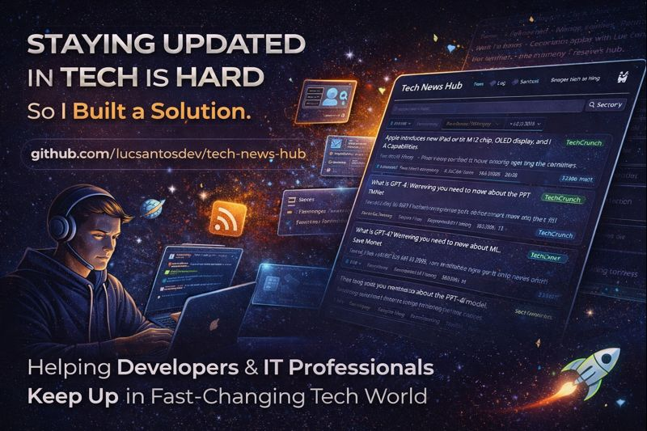

# 🚀 Tech News Hub

### 🌍 Idiomas / Languages / Línguas
[🇺🇸 English](../README.md) • [🇧🇷 Português](../pt-BR/README.md) • [🇪🇸 Español](README.md)

---

**Tu Centro Único para Noticias, Artículos y Actualizaciones de la Industria Tech** 📰

*Mantente a la vanguardia con fuentes curadas en todos los principales dominios tecnológicos*

[🚀 Inicio Rápido](QUICKSTART.md) • [⭐ Dale una estrella](#) • [🤝 Contribuye](CONTRIBUTING.md) • [📖 Explora Categorías](#-categorías)

---

## 📋 Tabla de Contenidos

- [Acerca de](#-acerca-de)
- [Categorías](#-categorías)
- [Navegación Rápida](#-navegación-rápida)
- [Cómo Usar](#-cómo-usar)
- [Contribuyendo](#-contribuyendo)
- [Comunidad](#-comunidad)
- [Licencia](#-licencia)

---

## 🎯 Acerca de

**Tech News Hub** es un repositorio integral e impulsado por la comunidad que agrega las mejores fuentes de noticias tech, blogs, newsletters y podcasts en varios dominios tecnológicos. Ya seas desarrollador de software, científico de datos, ingeniero DevOps o profesional de ciberseguridad, encontrarás recursos curados para mantenerte actualizado con las últimas tendencias, herramientas y mejores prácticas.

### ✨ ¿Por Qué Este Hub?

- 🎯 **Calidad Curada**: Fuentes seleccionadas de líderes de la industria
- 🗂️ **Organizado por Dominio**: Navegación fácil a través de categorías tech
- 🔄 **Actualizado Regularmente**: Las contribuciones de la comunidad mantienen el contenido fresco
- 🌐 **Cobertura Integral**: Desde IA hasta Web3, lo tenemos todo
- 📱 **Múltiples Formatos**: Blogs, newsletters, podcasts, canales de YouTube y más

---

## 🗂️ Categorías

Explora nuestra colección organizada de fuentes de noticias tech en estos dominios:

<table>
<tr>
<td align="center" width="33%">

### 💻 [Desarrollo de Software](categories/software-development.md)
Lenguajes, frameworks, mejores prácticas

</td>
<td align="center" width="33%">

### 🤖 [IA & Machine Learning](categories/ai-ml.md)
Deep learning, NLP, visión computacional

</td>
<td align="center" width="33%">

### ☁️ [Cloud & DevOps](categories/cloud-devops.md)
Infraestructura, CI/CD, contenedores

</td>
</tr>
<tr>
<td align="center" width="33%">

### 🔐 [Ciberseguridad](categories/cybersecurity.md)
Noticias de seguridad, vulnerabilidades

</td>
<td align="center" width="33%">

### 📊 [Data Science & Analytics](categories/data-science.md)
Big data, analytics, visualización

</td>
<td align="center" width="33%">

### 📱 [Desarrollo Mobile](categories/mobile-development.md)
iOS, Android, React Native, Flutter

</td>
</tr>
<tr>
<td align="center" width="33%">

### 🌐 [Desarrollo Web](categories/web-development.md)
Frontend, backend, full-stack

</td>
<td align="center" width="33%">

### ⛓️ [Blockchain & Web3](categories/blockchain-web3.md)
Crypto, DeFi, smart contracts

</td>
<td align="center" width="33%">

### 🎮 [Desarrollo de Juegos](categories/game-development.md)
Unity, Unreal, diseño de juegos

</td>
</tr>
<tr>
<td align="center" width="33%">

### 🗄️ [Database & Storage](categories/database.md)
SQL, NoSQL, gestión de datos

</td>
<td align="center" width="33%">

### 🏗️ [System Design](categories/system-design.md)
Arquitectura, escalabilidad, patrones

</td>
<td align="center" width="33%">

### 🚀 [Startups & Tech Business](categories/startups-business.md)
Emprendimiento, financiación, crecimiento

</td>
</tr>
</table>

---

## 🧭 Navegación Rápida

### Por Formato

- 📰 **Sitios de Noticias**: Próximamente
- 📧 **Newsletters**: Próximamente
- 🎙️ **Podcasts**: Próximamente
- 📺 **Canales de YouTube**: Próximamente
- 📝 **Blogs**: Próximamente
- 🐦 **Listas de Twitter/X**: Próximamente

### Por Frecuencia de Actualización

- ⚡ **Actualizaciones Diarias**: Próximamente
- 📅 **Resúmenes Semanales**: Próximamente
- 📆 **Resúmenes Mensuales**: Próximamente

---

## 📖 Cómo Usar

### Para Lectores

1. **Navega por Categorías**: Ve a tu área de interés desde la sección [categorías](#-categorías)
2. **Filtra por Formato**: Usa [navegación rápida](#-navegación-rápida) para encontrar podcasts, newsletters, etc.
3. **Guarda como Favorito**: Dale una estrella a este repo (⭐) para tenerlo a mano
4. **Mantente Actualizado**: Sigue este repo para nuevas adiciones

### Para Contribuidores

1. **Agrega Fuentes**: ¿Encontraste una fuente increíble de noticias tech? [¡Contribuye!](CONTRIBUTING.md)
2. **Sugiere Categorías**: ¿Crees que nos falta una categoría? Abre un issue
3. **Actualiza Enlaces**: Ayuda a mantener nuestras fuentes activas y relevantes
4. **Comparte**: Cuéntale a otros desarrolladores sobre este hub

---

## 🤝 Contribuyendo

¡Nos ❤️ las contribuciones! Este hub prospera con el aporte de la comunidad.

**Cómo contribuir:**

1. Haz fork de este repositorio
2. Agrega tus fuentes al archivo de categoría apropiado
3. Sigue nuestras [pautas de contribución](CONTRIBUTING.md)
4. Envía un pull request

**Qué contribuir:**

- ✅ Fuentes de noticias tech de alta calidad
- ✅ Blogs y newsletters activos
- ✅ Podcasts y canales de YouTube relevantes
- ✅ Nuevas categorías o mejoras
- ❌ Contenido promocional o spam

Consulta [CONTRIBUTING.md](CONTRIBUTING.md) para pautas detalladas.

---

## 💬 Comunidad

- 🌟 **Dale una estrella a este repo** si lo encuentras útil
- 🐛 **Reporta issues** si encuentras enlaces rotos
- 💡 **Comparte ideas** para mejoras
- 🔄 **Comparte este hub** con otros desarrolladores

---

## ☕ Apoya Este Proyecto

**¿Tomamos un Café y Programamos?**

Si este proyecto te resulta útil y quieres apoyar la producción continua de contenido, ¡considera invitarme un café! Tu apoyo ayuda a mantener este hub actualizado y en crecimiento.

💝 **Apoyo Mensual Disponible** - ¡Ayúdame a crear más contenido de calidad convirtiéndote en un patrocinador mensual en Ko-fi!

---

## 📜 Licencia

Este proyecto está licenciado bajo la Licencia MIT - consulta el archivo [LICENSE](../LICENSE) para más detalles.

---

**Hecho con ❤️ por la comunidad de desarrolladores**

[⬆ Volver Arriba](#-tech-news-hub)

